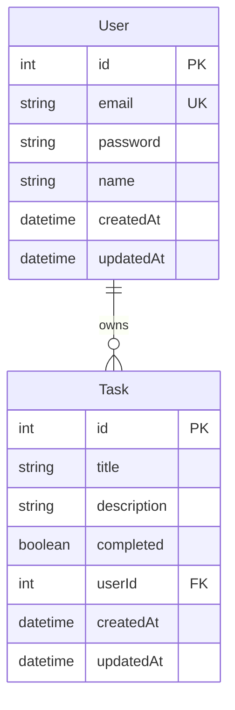
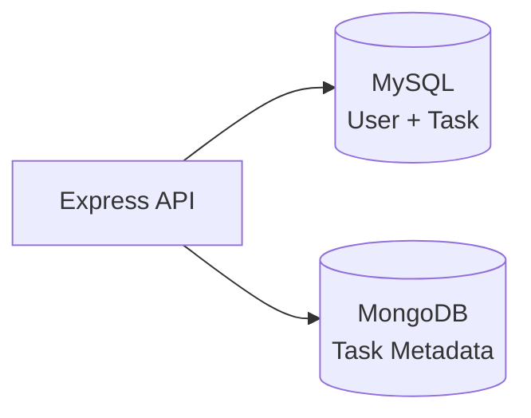

# TechX To-Do List

> Aplicação full-stack de gerenciamento de tarefas - Desafio Técnico Essentia Technologies.


---

## Sumário

- [Funcionalidades](#funcionalidades-implementadas)
- [Decisões Principais](#decisões-principais)
- [Tecnologias](#tecnologias-utilizadas)
- [Quick Start](#quick-start)
- [API](#api)
- [Banco de Dados](#banco-de-dados)
- [Testes](#testes)
- [CI/CD](#cicd)
- [Postman](#postman)
- [Docker](#docker)
- [Variáveis de Ambiente](#variáveis-de-ambiente)
- [Arquitetura](#arquitetura)

---

## Funcionalidades Implementadas

### Autenticação

- Registro de novas contas com senha criptografada (bcrypt)
- Login com geração de token JWT
- Rotas protegidas — cada usuário só acessa suas próprias tarefas

### Gerenciamento de Tarefas

- **Criar** — adicionar novas tarefas
- **Listar** — visualizar tarefas do usuário logado
- **Consultar** — buscar tarefa por ID
- **Atualizar** — editar título, descrição e status
- **Marcar como concluída** — alternar entre pendente e concluída
- **Deletar** — remover tarefa

### Metadados (MongoDB)

- Tags, prioridade (`low` | `medium` | `high`) e notas por tarefa
- Histórico de ações (criação, conclusão, atualizações)

### Infraestrutura e Qualidade

- Docker Compose (MySQL + MongoDB + API)
- Testes unitários com Vitest (services mockados)
- GitHub Actions — lint, testes e build em cada push/PR na `main`
- Collection Postman para testar a API

---

## Decisões Principais

As escolhas abaixo orientam o desenho do backend. Detalhes de SOLID, patterns e camadas estão em [docs/ARCHITECTURE.md](docs/ARCHITECTURE.md).

### MySQL + MongoDB (dual database)

**Problema:** tarefas exigem dados estruturados (usuário, título, status, FK) e, ao mesmo tempo, metadados flexíveis (tags, prioridade, histórico de ações).

**Escolha:** MySQL com Prisma para `User` e `Task`; MongoDB com Mongoose para `task_metadata`, referenciado pelo `taskId`.

**Trade-off:** mais infraestrutura para operar, mas cada banco resolve o que faz melhor — sem forçar arrays de histórico ou schema evolutivo no relacional.

### Camadas + interfaces + TSyringe

**Problema:** misturar HTTP, regra de negócio e SQL no mesmo lugar dificulta manutenção e testes.

**Escolha:** `Controller → Service → Repository`, com interfaces (`ITaskRepository`, `IAuthService`, etc.) e injeção via TSyringe.

**Trade-off:** mais arquivos e boilerplate do que um CRUD monolítico, porém cada camada tem responsabilidade clara e implementações podem ser trocadas ou mockadas.

### Regras de negócio no Service

**Problema:** garantir que um usuário só acesse suas próprias tarefas em todas as operações.

**Escolha:** centralizar ownership e orquestração no `TaskService` (ex.: `assertTaskOwnership`, histórico ao criar/concluir tarefa). Controllers ficam finos — recebem HTTP, delegam e respondem.

**Trade-off:** services um pouco mais verbosos, mas a regra vive em um único lugar, independente de Prisma, Mongoose ou formato da API.

### JWT stateless

**Problema:** autenticar uma SPA Angular sem manter sessão no servidor.

**Escolha:** login gera JWT assinado; middleware valida o token em rotas protegidas.

**Trade-off:** simplicidade e escalabilidade horizontal, em troca de revogação imediata de token e refresh flow mais elaborados (não implementados neste escopo).

### Testes unitários nos Services

**Problema:** testar a API inteira com banco real é lento e frágil para CI.

**Escolha:** Vitest nos services com repositórios mockados — foco em regras de negócio (auth, ownership, toggle, metadata).

**Trade-off:** não cobre integração HTTP/banco de ponta a ponta; isso fica para testes E2E ou Postman manual.

---

## Tecnologias Utilizadas

### Backend

| Camada | Tecnologias |
|--------|-------------|
| Runtime | Node.js 20+, TypeScript |
| API | Express 5, Zod (validação) |
| Arquitetura | TSyringe (DI), Controller → Service → Repository |
| Banco relacional | MySQL 8, Prisma ORM |
| Banco documento | MongoDB 7, Mongoose |
| Auth | JWT + bcrypt |
| Testes | Vitest |

### Frontend

| Camada | Tecnologias |
|--------|-------------|
| SPA | Angular 19, Angular Material, TypeScript |
| HTTP | HttpClient + interceptor JWT |
| Auth | Guards, localStorage, reactive forms |

### Ambiente

- Docker e Docker Compose
- GitHub Actions (CI do backend)
- Vercel (deploy do frontend Angular)

---

## Quick Start

### Pré-requisitos

- [Docker](https://www.docker.com/) e Docker Compose
- Node.js 20+ e npm 10+ *(apenas para modo desenvolvimento local)*

### Rodar com Docker (recomendado)

```bash
git clone <url-do-repositorio>
cd desafio-essentia

# Linux / macOS / Git Bash
cp backend/.env.example backend/.env

# Windows (PowerShell)
Copy-Item backend\.env.example backend\.env

docker compose up -d --build
```

Aguarde os containers subirem e verifique:

```bash
curl http://localhost:3000/api/health
```

Resposta esperada:

```json
{
  "status": "ok",
  "services": { "mysql": "connected", "mongo": "connected" }
}
```

| Serviço | URL |
|---------|-----|
| API | http://localhost:3000/api |
| Health check | http://localhost:3000/api/health |
| Frontend (dev) | http://localhost:4200 |

### Frontend (desenvolvimento)

Com a API rodando (Docker ou `npm run dev` no backend):

```bash
cp frontend/.env.example frontend/.env   # API_URL=http://localhost:3000/api
cd frontend
npm install
npm start
```

Abra http://localhost:4200 — cadastre-se ou entre e gerencie tarefas.

### Modo desenvolvimento (API fora do Docker)

Útil para hot reload durante o desenvolvimento:

```bash
docker compose up -d mysql mongo

cd backend
npm install
npm run db:migrate:deploy
npm run dev
```

> Não rode `npm run dev` na porta 3000 enquanto o container `backend` estiver ativo.

---

## API

Base URL: `http://localhost:3000/api`

### Endpoints públicos

| Método | Rota | Descrição |
|--------|------|-----------|
| `GET` | `/health` | Status da API e conexão com MySQL/MongoDB |
| `POST` | `/auth/register` | Cadastro (`name`, `email`, `password`) |
| `POST` | `/auth/login` | Login (`email`, `password`) → retorna JWT |

### Endpoints protegidos

Requer header: `Authorization: Bearer <token>`

| Método | Rota | Descrição |
|--------|------|-----------|
| `GET` | `/tasks` | Lista tarefas do usuário |
| `POST` | `/tasks` | Cria tarefa (`title`, `description?`) |
| `GET` | `/tasks/:id` | Busca tarefa por ID |
| `PUT` | `/tasks/:id` | Atualiza tarefa |
| `PATCH` | `/tasks/:id/toggle` | Alterna concluída/pendente |
| `DELETE` | `/tasks/:id` | Remove tarefa |
| `GET` | `/tasks/:id/metadata` | Metadados da tarefa (MongoDB) |
| `PUT` | `/tasks/:id/metadata` | Cria/atualiza metadados (`tags`, `priority`, `notes`) |

---

## Banco de Dados

### MySQL (Prisma) — dados principais



### MongoDB (Mongoose) — metadados por tarefa

Documento na collection `task_metadata`, referenciado pelo `taskId` do MySQL:

| Campo | Tipo | Descrição |
|-------|------|-----------|
| `taskId` | number | ID da tarefa no MySQL (único) |
| `userId` | number | Dono da tarefa |
| `tags` | string[] | Etiquetas |
| `priority` | enum | `low`, `medium`, `high` |
| `notes` | string | Observações |
| `history` | array | Log de ações (`action`, `at`) |

### Arquitetura de persistência



---

## Testes

Testes unitários dos services com repositórios mockados (sem banco real):

```bash
cd backend
npm test
```

| Comando | Descrição |
|---------|-----------|
| `npm test` | Executa todos os testes |
| `npm run test:watch` | Modo watch |
| `npm run test:coverage` | Relatório de cobertura |

Cobertura atual: `AuthService` e `TaskService`.

---

## CI/CD

### GitHub Actions

Workflow em [`.github/workflows/ci.yml`](.github/workflows/ci.yml) — dispara em **push** e **pull request** na branch `main`:

| Etapa | Comando | Descrição |
|-------|---------|-----------|
| Lint | `npm run lint` | ESLint no código TypeScript |
| Test | `npm test` | 22 testes unitários (Vitest) |
| Build | `npm run build` | Prisma generate + compilação |

O job usa `backend/.env.example` como `.env` — não precisa de MySQL/Mongo reais no CI.

### Vercel (frontend)

Configuração em [`frontend/vercel.json`](frontend/vercel.json):

1. Importe o repositório em [vercel.com](https://vercel.com)
2. **Root Directory:** `frontend`
3. **Environment Variable:** `API_URL` → URL pública da API (ex.: `https://sua-api.com/api`)
4. Atualize `src/environments/environment.production.ts` com a mesma `apiUrl` *(ou configure file replacement no build)*

> A API Express roda melhor em Docker (Render, Railway, etc.). Vercel fica reservado ao **frontend** Angular.

### Deploy da API (produção)

```bash
docker compose up -d --build
```

Ou publique a imagem `backend/Dockerfile` em um serviço containerizado com MySQL e MongoDB gerenciados.

---

## Postman

Importe os arquivos em `postman/`:

1. `TechX-Todo-API.postman_collection.json`
2. `local.postman_environment.json`

Fluxo sugerido:

1. **Auth → Register** ou **Login** *(salva o token automaticamente)*
2. **Tasks → Create Task**
3. **Tasks → Get Metadata** / **Upsert Metadata**

---

## Docker

| Serviço | Imagem | Porta | Credenciais |
|---------|--------|-------|-------------|
| MySQL | `mysql:8` | 3306 | user: `techx` · senha: `techx123` · db: `techx_todo` |
| MongoDB | `mongo:7` | 27017 | sem auth (dev) |
| Backend | `backend/Dockerfile` | 3000 | Prisma migrate + API |

Comandos úteis:

```bash
docker compose up -d --build      # stack completa
docker compose up -d mysql mongo    # somente bancos
docker compose ps                   # status
docker compose logs -f backend      # logs da API
docker compose down                 # parar
docker compose down -v              # parar e remover volumes
```

No Docker, o Compose carrega `backend/.env` e **sobrescreve** `DATABASE_URL` e `MONGODB_URI` para os hosts internos `mysql` e `mongo`.

<details>
<summary><strong>Scripts do backend</strong></summary>

| Comando | Descrição |
|---------|-----------|
| `npm run dev` | Servidor com hot reload |
| `npm run build` | Compila TypeScript |
| `npm run start` | Produção (`dist/`) |
| `npm run lint` | ESLint |
| `npm run format` | Prettier |
| `npm run db:migrate` | Migrations (dev) |
| `npm run db:migrate:deploy` | Migrations (prod/CI) |
| `npm run db:studio` | Prisma Studio |

</details>

---

## Variáveis de Ambiente

| Arquivo | Uso |
|---------|-----|
| `backend/.env` | Segredos e infra: MySQL, MongoDB, JWT, porta, CORS |
| `frontend/.env` | Config pública: `API_URL` *(quando o Angular estiver pronto)* |

```bash
cp backend/.env.example backend/.env
cp frontend/.env.example frontend/.env
```

> Nunca coloque `JWT_SECRET` ou credenciais de banco no `frontend/.env` — variáveis do Angular ficam expostas no build.

---

## Arquitetura

Fluxo de uma requisição:

```
HTTP Request → Controller → Service → Repository → MySQL / MongoDB
```

Validação de entrada com **Zod** nos DTOs; erros de domínio mapeados por middleware global.

Documentação completa (SOLID, patterns, camadas): [docs/ARCHITECTURE.md](docs/ARCHITECTURE.md)

### Estrutura do projeto

```
.
├── .github/workflows/  # CI (GitHub Actions)
├── backend/          # API REST (Express + TypeScript)
│   ├── prisma/       # Schema e migrations MySQL
│   ├── src/          # Controllers, services, repositories
│   └── tests/        # Testes unitários (Vitest)
├── frontend/         # SPA Angular + Material
│   ├── src/app/      # features (auth, tasks), core (services, guards)
│   └── vercel.json   # Config de deploy Vercel
├── docs/             # Documentação de arquitetura
├── postman/          # Collection para testes da API
└── docker-compose.yml
```

---

Desenvolvido por **Matheus de Oliveira Soares**
