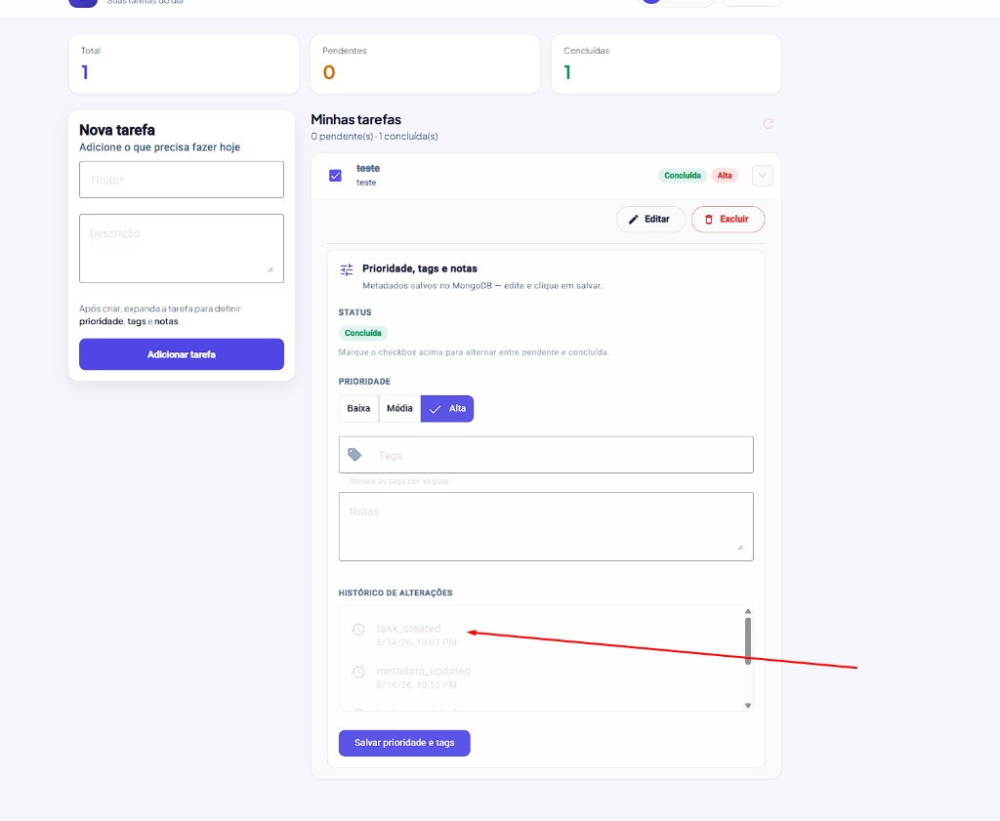
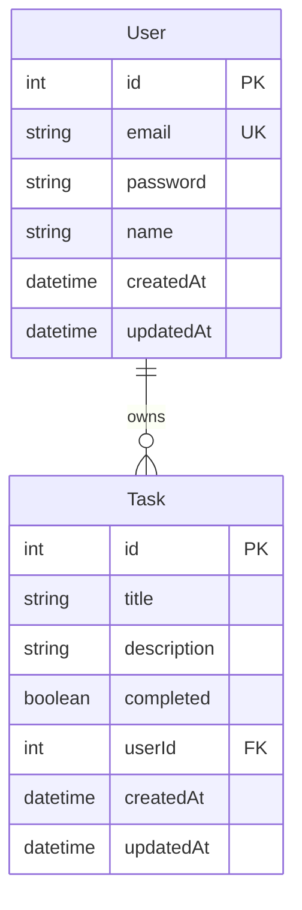
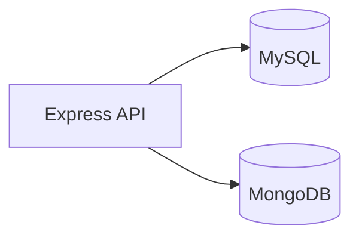

# TechX To-Do List

> Aplicação full-stack de gerenciamento de tarefas — **Desafio Técnico Essentia Technologies** (TechX).

Cadastre-se, faça login e gerencie tarefas com prioridade, tags, notas e histórico de alterações. Backend em camadas com JWT, MySQL (Prisma) e metadados no MongoDB (Mongoose). Frontend Angular 19 com Material, tema claro/escuro e deploy na Vercel.



| | |
|---|---|
| **Repositório** | [github.com/mattspider/desafio-essentia-tecnologies-](https://github.com/mattspider/desafio-essentia-tecnologies-) |
| **API (produção)** | [desafio-essentia-tecnologies-production.up.railway.app/api](https://desafio-essentia-tecnologies-production.up.railway.app/api) |
| **Health check** | […/api/health](https://desafio-essentia-tecnologies-production.up.railway.app/api/health) |
| **Frontend** | Deploy na Vercel — veja [Deploy](#deploy) |


---

## Sumário

- [Funcionalidades](#funcionalidades)
- [Decisões principais](#decisões-principais)
- [Tecnologias](#tecnologias)
- [Quick Start](#quick-start)
- [Entrega do desafio](#entrega-do-desafio)
- [API](#api)
- [Banco de dados](#banco-de-dados)
- [Testes](#testes)
- [CI/CD](#cicd)
- [Deploy](#deploy)
- [Postman](#postman)
- [Docker](#docker)
- [Variáveis de ambiente](#variáveis-de-ambiente)
- [Arquitetura](#arquitetura)
- [Documentação adicional](#documentação-adicional)

---

## Funcionalidades

### Autenticação

- Registro com senha criptografada (bcrypt)
- Login com JWT (7 dias, configurável)
- Rotas protegidas — cada usuário acessa apenas suas tarefas

### Tarefas (MySQL)

- Criar, listar, consultar, atualizar e excluir
- Alternar status pendente / concluída (`PATCH /toggle`)
- Validação de ownership em todas as operações

### Metadados (MongoDB — desafio extra)

- Tags, prioridade (`low` | `medium` | `high`) e notas
- Histórico de ações (`task_created`, `metadata_updated`, etc.)
- Painel expansível no frontend com formulário integrado

### Frontend (Angular)

- Telas de login e cadastro (layout split, validação reativa)
- Dashboard com cards de estatísticas (total, pendentes, concluídas)
- Lista de tarefas com badges de status, prioridade e tags
- Tema claro / escuro persistente
- Integração HTTP com interceptor JWT e guards de rota

### Qualidade e DevOps

- Docker Compose (MySQL + MongoDB + API)
- Testes unitários backend (Vitest) e frontend (Karma)
- GitHub Actions — lint, testes e build em cada PR
- Collection Postman (local + produção)

---

## Decisões principais

Resumo das escolhas arquiteturais. Detalhes de SOLID, patterns e camadas: [docs/ARCHITECTURE.md](docs/ARCHITECTURE.md).

| Tema | Escolha | Motivo |
|------|---------|--------|
| **Dual DB** | MySQL (User/Task) + MongoDB (metadata) | Dados estruturados + metadados flexíveis sem forçar schema relacional |
| **Camadas** | Controller → Service → Repository + interfaces | SRP, testabilidade, DIP com TSyringe |
| **Regras de negócio** | Centralizadas no Service (`assertTaskOwnership`, histórico) | Controllers finos; ownership em um único lugar |
| **Auth** | JWT stateless | Adequado à SPA; sem sessão no servidor |
| **Testes** | Vitest com mocks de interface | CI rápido; foco em regras de negócio |
| **Deploy** | Vercel (FE) + Railway/Docker (API) | Express + MySQL não rodam bem como serverless na Vercel |

---

## Tecnologias

### Backend

| Camada | Stack |
|--------|-------|
| Runtime | Node.js 20+, TypeScript |
| API | Express 5, Zod |
| Arquitetura | TSyringe, Controller → Service → Repository |
| SQL | MySQL 8, Prisma |
| NoSQL | MongoDB 7, Mongoose |
| Auth | JWT + bcrypt |
| Testes | Vitest |

### Frontend

| Camada | Stack |
|--------|-------|
| SPA | Angular 19, Angular Material, TypeScript |
| HTTP | HttpClient + interceptor JWT |
| Auth | Guards, localStorage, Reactive Forms |
| UI | SCSS design tokens, tema claro/escuro |

### Infra

- Docker Compose · GitHub Actions · Vercel · Railway

---

## Quick Start

### Pré-requisitos

- [Docker](https://www.docker.com/) e Docker Compose
- Node.js 20+ e npm 10+ *(desenvolvimento local sem Docker)*

### Rodar com Docker (recomendado)

```bash
git clone https://github.com/mattspider/desafio-essentia-tecnologies-.git
cd desafio-essentia-tecnologies-

# Linux / macOS / Git Bash
cp backend/.env.example backend/.env

# Windows (PowerShell)
Copy-Item backend\.env.example backend\.env

docker compose up -d --build
```

Verifique a API:

```bash
curl http://localhost:3000/api/health
```

| Serviço | URL |
|---------|-----|
| API | http://localhost:3000/api |
| Health | http://localhost:3000/api/health |
| Frontend (dev) | http://localhost:4200 |

### Frontend (desenvolvimento)

Com a API rodando:

```bash
cd frontend
npm install
npm start
```

Abra http://localhost:4200. O dev server usa `environment.development.ts` (`http://localhost:3000/api`) — não precisa de `frontend/.env` para `ng serve`.

### API fora do Docker (hot reload)

```bash
docker compose up -d mysql mongo

cd backend
npm install
cp .env.example .env   # se ainda não existir
npm run db:migrate:deploy
npm run dev
```

> Não rode `npm run dev` na porta 3000 enquanto o container `backend` estiver ativo.

---

## Entrega do desafio

### O que foi entregue

| Requisito | Status |
|-----------|--------|
| API REST Node.js + TypeScript | ✅ |
| CRUD de tarefas + marcar concluída | ✅ |
| MySQL (dados principais) | ✅ |
| JWT + autenticação | ✅ |
| MongoDB (metadados extras) | ✅ |
| Frontend Angular 14+ | ✅ (Angular 19) |
| Docker + README com setup | ✅ |
| Commits incrementais + CI | ✅ |
| Deploy (API + FE) | ✅ API Railway · FE Vercel |

### Como avaliar rapidamente

1. **Online:** acesse a API em [health](https://desafio-essentia-tecnologies-production.up.railway.app/api/health) e o frontend na URL da Vercel (após deploy).
2. **Local:** `docker compose up -d --build` → `cd frontend && npm start` → cadastre usuário → crie tarefa → expanda painel → salve prioridade/tags.
3. **API:** importe a [collection Postman](#postman) e rode Auth → Tasks.
4. **Testes:** `cd backend && npm test` e `cd frontend && npm run test:ci`.

### Repositório

```bash
git clone https://github.com/mattspider/desafio-essentia-tecnologies-.git
```

Branch principal: `main`.

---

## API

Base URL local: `http://localhost:3000/api`  
Base URL produção: `https://desafio-essentia-tecnologies-production.up.railway.app/api`

### Públicos

| Método | Rota | Descrição |
|--------|------|-----------|
| `GET` | `/health` | Status + conexão MySQL/MongoDB |
| `POST` | `/auth/register` | Cadastro (`name`, `email`, `password`) |
| `POST` | `/auth/login` | Login → `{ token, user }` |

### Protegidos

Header: `Authorization: Bearer <token>`

| Método | Rota | Descrição |
|--------|------|-----------|
| `GET` | `/tasks` | Lista tarefas do usuário |
| `POST` | `/tasks` | Cria (`title`, `description?`) |
| `GET` | `/tasks/:id` | Detalhe |
| `PUT` | `/tasks/:id` | Atualiza |
| `PATCH` | `/tasks/:id/toggle` | Alterna concluída/pendente |
| `DELETE` | `/tasks/:id` | Remove (+ metadata no Mongo) |
| `GET` | `/tasks/:id/metadata` | Metadados |
| `PUT` | `/tasks/:id/metadata` | Upsert (`tags`, `priority`, `notes`) |

---

## Banco de dados

### MySQL (Prisma)



### MongoDB — `task_metadata`

| Campo | Tipo | Descrição |
|-------|------|-----------|
| `taskId` | number | FK lógica (MySQL), único |
| `userId` | number | Dono |
| `tags` | string[] | Etiquetas |
| `priority` | enum | `low`, `medium`, `high` |
| `notes` | string | Observações |
| `history` | array | `{ action, at }` |



---

## Testes

### Backend (Vitest)

```bash
cd backend
npm test
```

| Comando | Descrição |
|---------|-----------|
| `npm test` | Todos os testes |
| `npm run test:watch` | Watch mode |
| `npm run test:coverage` | Cobertura |

Cobertura: `AuthService`, `TaskService` (repositórios mockados).

### Frontend (Karma)

```bash
cd frontend
npm run test:ci
```

---

## CI/CD

Workflow: [`.github/workflows/ci.yml`](.github/workflows/ci.yml) — push e PR na `main`.

**Backend:** lint → test (Vitest) → build (Prisma + tsc)  
**Frontend:** test:ci (Karma headless) → build:ci

O CI usa `backend/.env.example`. O frontend gera `environment.production.ts` via `API_URL` (padrão localhost).

---

## Deploy

Guia completo: **[docs/DEPLOY.md](docs/DEPLOY.md)**

### Resumo

| Alvo | Plataforma | Configuração chave |
|------|------------|-------------------|
| Frontend | **Vercel** | Root: `frontend` · `API_URL=https://…/api` |
| API | **Railway** (ou Docker) | `DATABASE_URL`, `MONGODB_URI`, `JWT_SECRET`, `CORS_ORIGIN` |

**CORS:** `CORS_ORIGIN` no backend deve ser a URL **exata** do frontend (copie do botão Visit na Vercel).

**Build Docker:** o `backend/Dockerfile` compila com `npx tsc` (sem exigir `.env` no build).

### Variáveis Vercel (Production)

```env
API_URL=https://desafio-essentia-tecnologies-production.up.railway.app/api
```

### Variáveis Railway (backend)

```env
DATABASE_URL=${{MySQL.MYSQL_URL}}
MONGODB_URI=${{MongoDB.MONGO_URL}}
JWT_SECRET=<segredo-forte>
NODE_ENV=production
CORS_ORIGIN=https://<seu-app>.vercel.app
```

---

## Postman

Arquivos em `postman/`:

| Arquivo | Uso |
|---------|-----|
| `TechX-Todo-API.postman_collection.json` | Todos os endpoints |
| `local.postman_environment.json` | `http://localhost:3000` |
| `production.postman_environment.json` | API Railway |

Fluxo:

1. **Auth → Register** ou **Login** *(token salvo automaticamente)*
2. **Tasks → Create Task**
3. **Tasks → Upsert Metadata** / **Get Metadata**

---

## Docker

| Serviço | Imagem | Porta | Credenciais (dev) |
|---------|--------|-------|-------------------|
| MySQL | `mysql:8` | 3306 | `techx` / `techx123` / `techx_todo` |
| MongoDB | `mongo:7` | 27017 | sem auth |
| Backend | `backend/Dockerfile` | 3000 | migrate + API |

```bash
docker compose up -d --build      # stack completa
docker compose up -d mysql mongo  # só bancos
docker compose logs -f backend
docker compose down -v            # parar + remover volumes
```

<details>
<summary><strong>Scripts do backend</strong></summary>

| Comando | Descrição |
|---------|-----------|
| `npm run dev` | Hot reload |
| `npm run build` | Prisma generate + tsc |
| `npm run start` | Produção |
| `npm run lint` | ESLint |
| `npm run db:migrate` | Migrations (dev) |
| `npm run db:migrate:deploy` | Migrations (prod) |
| `npm run db:studio` | Prisma Studio |

</details>

---

## Variáveis de ambiente

| Arquivo | Uso |
|---------|-----|
| `backend/.env` | MySQL, MongoDB, JWT, porta, CORS |
| `frontend/.env` | `API_URL` apenas para **build de produção** local |

```bash
cp backend/.env.example backend/.env
cp frontend/.env.example frontend/.env
```

| Variável (backend) | Descrição |
|--------------------|-----------|
| `DATABASE_URL` | Connection string MySQL |
| `MONGODB_URI` | Connection string MongoDB |
| `JWT_SECRET` | Segredo de assinatura |
| `JWT_EXPIRES_IN` | Expiração do token (ex.: `7d`) |
| `PORT` | Porta HTTP (padrão `3000`) |
| `CORS_ORIGIN` | Origem permitida (uma URL) |

| Variável (frontend) | Descrição |
|---------------------|-----------|
| `API_URL` | Base da API com `/api` (Vercel/CI) |

> Nunca coloque `JWT_SECRET` no frontend — variáveis Angular ficam expostas no bundle.

---

## Arquitetura

```
HTTP → Controller → Service → Repository → MySQL / MongoDB
```

- Validação: **Zod** nos DTOs
- Erros de domínio: middleware global
- DI: **TSyringe** em `backend/src/container/`

### Estrutura do monorepo

```
.
├── .github/workflows/     # CI
├── backend/               # API Express + TypeScript
│   ├── prisma/            # Schema e migrations
│   ├── src/               # Camadas + infra
│   └── tests/             # Vitest
├── frontend/              # Angular 19 + Material
│   ├── src/app/
│   │   ├── core/          # Auth, guards, theme
│   │   ├── features/      # auth, tasks
│   │   └── shared/
│   └── vercel.json
├── docs/                  # Arquitetura, deploy, screenshots
├── postman/
└── docker-compose.yml
```

---

## Documentação adicional

| Documento | Conteúdo |
|-----------|----------|
| [docs/ARCHITECTURE.md](docs/ARCHITECTURE.md) | SOLID, patterns, fluxo de requisição, pastas |
| [docs/DEPLOY.md](docs/DEPLOY.md) | Railway, Vercel, CORS, checklist |
| [frontend/README.md](frontend/README.md) | Scripts e env do Angular |

---

Desenvolvido por **Matheus de Oliveira Soares** — Desafio Essentia Technologies / TechX.
